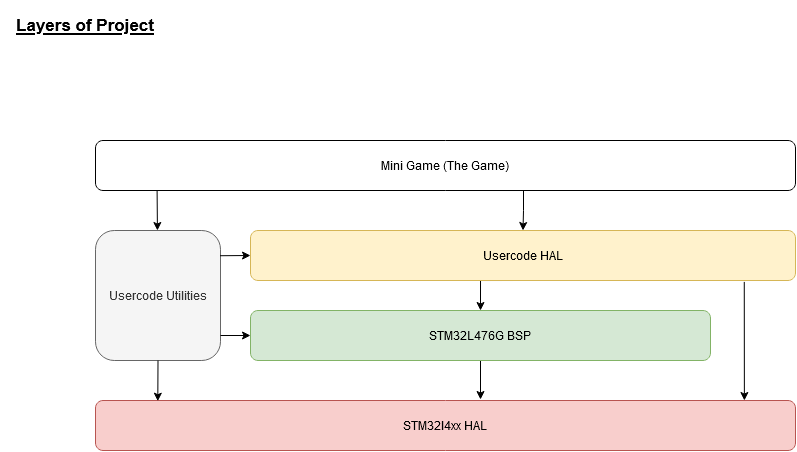

<!-- omit in toc -->
## Mini Reaction Game 

- [Project Idea](#project-idea)
- [Development](#development)
- [Architecture/Design](#architecturedesign)
  - [Layers](#layers)
  - [GameFlow](#gameflow)
- [Gamemanual](#gamemanual)
  - [1. Game configuration](#1-game-configuration)
  - [2. The Game](#2-the-game)

## Project Idea

Goal of the Project ist the development of a mini game. The game is described below.

The following hardware of the STM32L476G-DISCO Board board is used:
* Joystick
  * left, right: configuration, led flashing, input (green: right, red: left)
  * Joystick-Center - Enter
* LED (green and red) for flash sequence
* LCD Display: Arrow + State messages

* Accelerometer and magnetometer (lsm303c)
* (for mobility: battery or Powerbank over USB)

## Development

* For development the STM32Cube IDE is used
* To get a highlevel API the Board BSP from ST is used (see doc/bsp_guide.md)

## Architecture/Design

### Layers

I tried to build up kind of a layered architecture, see below.

### GameFlow

## Gamemanual

### 1. Game configuration

* Configuration via joystick (selection), center is Enter, using LCD Display for output
* Optional: Calibration of the mems magnet sensor (30 sec. rotating)
  * You must fullfile at least one rotation!
* Select player count 2 or 4 (rotation 90° or 180° ... limitation due display arrow)
* Select difficulty level (easy, medium, advanced, hardcore)
  * determing difficulty of the flash sequence (f.e.: easy - green, green, red)
  * the goal is the sequence not the timing but if the pause between inputs > 1.5 seconds set state to *Failed*

### 2. The Game

1. The display shows Go
2. Player start: rotating that the board so that it's in front of u, display on top
3. Press Center Button
4. LEDs show a flash sequence **Green + Red LED**
5. Then an arrow on the LCD starts rotating
6. When the arrow stops it points to the next player (the display shows Rotate and full bars)
7. This player must now rotate the board so it's in front of him (see step 2.)
   * there is a timeout for doing this -> the bars on the display visualize this.
8. When the board is at the right angle it shows FLASH -> now the player should replicate the sequence with the joystick (see Step 4)
9. Verification:
     * If the user enter the sequence correct: the display shows Victory.
     * If the user has failed: the display shows Failed
10. Back to step 1.