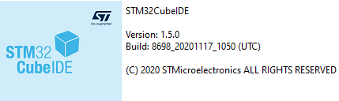

# Project Journey

- [Project Journey](#project-journey)
  - [Common](#common)
  - [The long way](#the-long-way)
    - [1. Project Setup/Environment](#1-project-setupenvironment)
    - [2. Calculate Heading](#2-calculate-heading)
    - [3. Calibration](#3-calibration)
    - [3. The Arrows](#3-the-arrows)
      - [Starting Point](#starting-point)
      - [Calculation](#calculation)
  - [4. The game itself](#4-the-game-itself)

## Common

Here I try to describe how I've developed the different parts of the project.

## The long way

### 1. Project Setup/Environment

First I tried mBedOS:
* Pros:
  * Easy to use
* Cons:
  * Long Build Time + CPU Usage for Indexing (regarding to huge junk of file)
  * Now Debugging since requiring pyOCD (we need gdb)
  * imho: too highlevel/abstract

Since I don't like to program every tiny bit myself, just STM Cube with CMSIS HAL would not be satisfying. I found out that STM provides an BSP for this board (see: bsp_guide). To make this run i had to fix some warnings in the BSP (since the project is built with *-werror*)

**So I use STM Cube IDE with the BSP**:



* Pros:
  * Debugging via IDE
  * Faster build time
  * more control over whats happening in the code
  * Pure C
* Cons:
  * (not fancy in Electron just a Eclipse RCP)

### 2. Calculate Heading

I looked up how to calculate the heading (without tilt compensation since the board is rotated flat on the table), and came up with this solution:

<div style="page-break-after: always;"></div>


``` C
/**  
 * Calculate heading for given x & y axis values (of MEMS magnetic field sensor).
 *
 * @param x value on x axis
 * @param y value on x axis
 * @return the heading angle in degrees (no tilt compensation)
 */
double _heading_CalcHeading(double x, double y) {
	double heading = (atan2(y * M_GN, x * M_GN) * 180) / M_PI;
	return heading < 0 ? heading + 360 : heading;
}
```
After reading the first few values and printing them out, I recognized that the data can't be correct. So I found out that the magnet sensor must be calibrated (cause of deviation in the production, every sensor is unique and must therefor be calibrated), to elimenate this Errors.
* Errors:
  * Hard iron bias: Offset of the magnet sensor (in code: bias\[Axis])
  * Soft iron bias: Each of the three axis has a different sensitivity (in code: range\[Axis])

### 3. Calibration

Below you see the calibration method and the storing in the flash memory over QSPI. It's a simple method (see [here](https://github.com/kriswiner/MPU6050/wiki/Simple-and-Effective-Magnetometer-Calibration)) with enough accuracy. If you want even more precise value you have to do crazy complicated transformations.

``` C
void compass_Calibrate() {
	int16_t magBuffer[3];
	int16_t toDo = CALIBRATION_SAMPLES;
	int16_t xMax = 0;
	int16_t yMax = 0;
	int16_t zMax = 0;
	int16_t xMin = INT16_MAX;
	int16_t yMin = INT16_MAX;
	int16_t zMin = INT16_MAX;

	display_Write("DO CAL");
	DEBUG_PRINTF("I: Calibrating compass ...");
	while (toDo) {
		compass_GetRawValues(magBuffer);
		xMax = max(xMax, magBuffer[0]);
		yMax = max(yMax, magBuffer[1]);
		zMax = max(zMax, magBuffer[2]);
		xMin = min(xMin, magBuffer[0]);
		yMin = min(yMin, magBuffer[1]);
		zMin = min(zMin, magBuffer[2]);
		toDo--;
		HAL_Delay(SAMPLES_DELAY_MS);
	}
	calibration.biasX = (xMax + xMin) / 2;
	calibration.rangeX = (xMax - xMin) / 2;
	calibration.biasY = (yMax + yMin) / 2;
	calibration.rangeY = (yMax - yMin) / 2;
	calibration.biasZ = (zMax + zMin) / 2;
	calibration.rangeZ = (zMax - zMin) / 2;

	DEBUG_PRINTF("I: Calibration done");
	calibration.magic = CALIBRATION_MAGIC;
	BSP_QSPI_Erase_Chip();
	BSP_QSPI_Write((uint8_t*) &calibration, CALIBRATION_ADDRESS, sizeof(compass_calibration_t));
	DEBUG_PRINTF("I: Calibration stored");
}
```

### 3. The Arrows

Since the BSP don't provide a method to display an arrow in the middle of the LCD, I've extended the BSP to provide this feature. For this I calculated the arrows (see below) and added them as symbol to the BSP.

Adding needed 4 Arrows as Character to BSP
* Arrow North
* Arrow South
* Arrow West
* West East

* Since the BSP was not building without warnings (building it with -werror Flag), I had to fix some warnings (Remove µ and ° (multi character which the display couldn't display anyway)).

#### Starting Point

In BSP: stm32l476g_discovery_glass_lcd.c

``` C
LCD segment mapping:
--------------------
  -----A-----        _
  |\   |   /|   COL |_|
  F H  J  K B
  |  \ | /  |        _
  --G-- --M--   COL |_|
  |  / | \  |
  E Q  P  N C
  |/   |   \|        _
  -----D-----   DP  |_|

 An LCD character coding is based on the following matrix:
COM           0   1   2     3
SEG(n)      { E , D , P ,   N   }
SEG(n+1)    { M , C , COL , DP  }
SEG(23-n-1) { B , A , K ,   J   }
SEG(23-n)   { G , F , Q ,   H   }
with n positive odd number.

 The character 'A' for example is:
  -------------------------------
LSB   { 1 , 0 , 0 , 0   }
      { 1 , 1 , 0 , 0   }
      { 1 , 1 , 0 , 0   }
MSB   { 1 , 1 , 0 , 0   }
      -------------------
  'A' =  F    E   0   0 hexa
```

* Above you see how "A" the value for is created
* Now use this to calculate values for arrows.

#### Calculation

* Arrow West "<"
  * Segment 3: K & N
``` C

        -------------------------------
        LSB   { 0 , 0 , 0 , 1   }
              { 0 , 1 , 0 , 0   }
              { 1 , 0 , 1 , 0   }
        MSB   { 0 , 0 , 0 , 0   }
            -------------------
                0   0   4   1 hexa
```
* Arrow East ">"
  * Segment 4: H & Q
``` C

        -------------------------------
        LSB   { 0 , 0 , 0 , 0   }
              { 0 , 0 , 0 , 0   }
              { 0 , 0 , 0 , 0   }
        MSB   { 0 , 0 , 1 , 1   }
            -------------------
                0   0   8   8 hexa
```
* Arrow North1 "|"
  * Segment 3: K
``` C

        -------------------------------
        LSB   { 0 , 0 , 0 , 0   }
              { 0 , 0 , 0 , 0   }
              { 0 , 0 , 0 , 0   }
        MSB   { 0 , 0 , 0 , 1   }
            -------------------
                0   0   4   0 hexa
```
* Arrow North2 "!"
* Segment 4: H
``` C

        -------------------------------
        LSB   { 0 , 0 , 0 , 0   }
              { 0 , 0 , 0 , 0   }
              { 0 , 0 , 0 , 0   }
        MSB   { 0 , 0 , 0 , 1   }
            -------------------
                0   0   0   8 hexa
```

* Arrow South1 "_"
  * Segment 3: N
``` C

        -------------------------------
        LSB   { 0 , 0 , 0 , 1   }
              { 0 , 0 , 0 , 0   }
              { 0 , 0 , 0 , 0   }
        MSB   { 0 , 0 , 0 , 0   }
            -------------------
                0   0   0   1 hexa
```
* Arrow South2 "#"
* Segment 4: Q
``` C

        -------------------------------
        LSB   { 0 , 0 , 0 , 0   }
              { 0 , 0 , 0 , 0   }
              { 0 , 0 , 0 , 0   }
        MSB   { 0 , 0 , 1 , 0   }
            -------------------
                0   0   8   0 hexa
```

After the calculation, I added the defines (in: *stm32l476g_discovery_glass_lcd.h*):

```C
/* constant code for arrow west */
#define C_ARROW_WEST		  ((uint16_t) 0x0041)

```
they are used in the Convert() (Convert an ascii char to the a LCD digit) function of the BSP, so I mapped the new LCD Arrows to some free characters.

Then I added a corresponding function for each arrow (in: *stm32l476g_discovery_glass_lcd.c*):

``` C
/**
 * Added by user.
 *
 * Print an Arrow West in the middle of LCD Glass
 */
void BSP_LCD_GLASS_DisplayArrowWest()
{
	WriteChar((uint8_t *) "<" , 0, 0, 2);

	/* Update the LCD display */
	HAL_LCD_UpdateDisplayRequest(&LCDHandle);
}
```

## 4. The game itself

The Game itself is a huge cascade ot tiny functions, if's and loops. I kind of underestimated that at the start of the project.