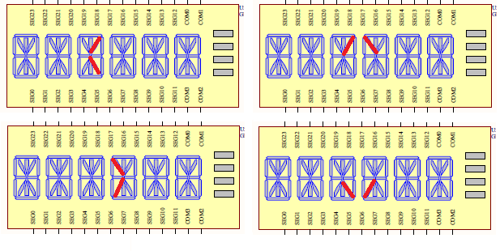

<!-- omit in toc -->
# Projekt Hardwarenahe Programmierung 2020: Kraxner Thomas

## Mini Reaktionsspiel 

### Beschreibung

Es handelt sich hierbei um ein Mini Geschicklichkeitsspiel. Der Spielablauf wird in [Spielablauf](#2-spielablauf) beschrieben.

Es wird folgende Peripherie auf dem STM32L476G-DISCO Board verwendet:
* Joystick 
  * Links, Rechts: Konfiguration, Blinkmuster Eingabe (Grün: rechts, Rot: Links)
  * Joystick-Center - Bestätigen
* LED (grün und rot) für Blinkmuster
* LCD Display: Pfeil + Statusausgaben

* Accelerometer and magnetometer (lsm303c)
* (Für Mobilität: Knopfbatterien oder Powerbank über USB)

### 1. Spielkonfiguration

* Einstellung erfolgt mittels Joystick (Selektion), Center (Bestätigen) - Anzeige LCD Display
* Kalibrieren der Magnet Sensoren (20 sec. Rotieren)
* Auswahl der Spielerzahl 2 oder 4 (Drehung 90° oder 180°, Limitierung Display Pfeil)
* Auswahl des Schwierigkeitgrades (easy, medium, advanced, hardcore)
  * Anzahl wie oft geblinkt wird (z.B. für easy: grün, grün, rot). Es geht eher darum sich die Sequence zu Merken als um das Timing. Ist die Pause zwischen der Eingabe jedoch > 1.5s wird der Versuch als *Failed* gewertet.

### 2. Spielablauf

1. Ein Spieler beginnt indem er das Board gerade vor sich ausrichtet und Joystick Center betätigt
2. Die Grüne und Rote LED produzieren ein Blinkmuster (je nach Schwierigkeitsgrad)
3. Auf dem Display beginnt sich ein Pfeil zu drehen (wie bei Flaschen drehen, schön animieren zuerst schnell, dann langsamer), dieser bleibt random bei einem Spieler stehen.
4. Der Spieler zu dem der Pfeil zeigt, muss nun das Board zu sich drehen (mit Timelimit visualisiert über Bars auf Display), und das Blinkmuster mit dem Joystick reproduzieren.
5. Wurde das Blinkmuster korrekt eingegeben wird auf dem LCD Display - "Victory" sonst "Fail" ausgegeben.
   * Hat der Spieler die Sequencen falsch eingeben oder war zu langsam mit Board zu sich drehen, ist er ausgeschieden 
      1. Wenn Spieleranzahl == 1: Hat der überig gebliebene Spieler gewonnen.
6. Der aktive Spieler (auch wenn ausgeschieden) drückt Joystick Center -> weiter mit Schritt 2.
