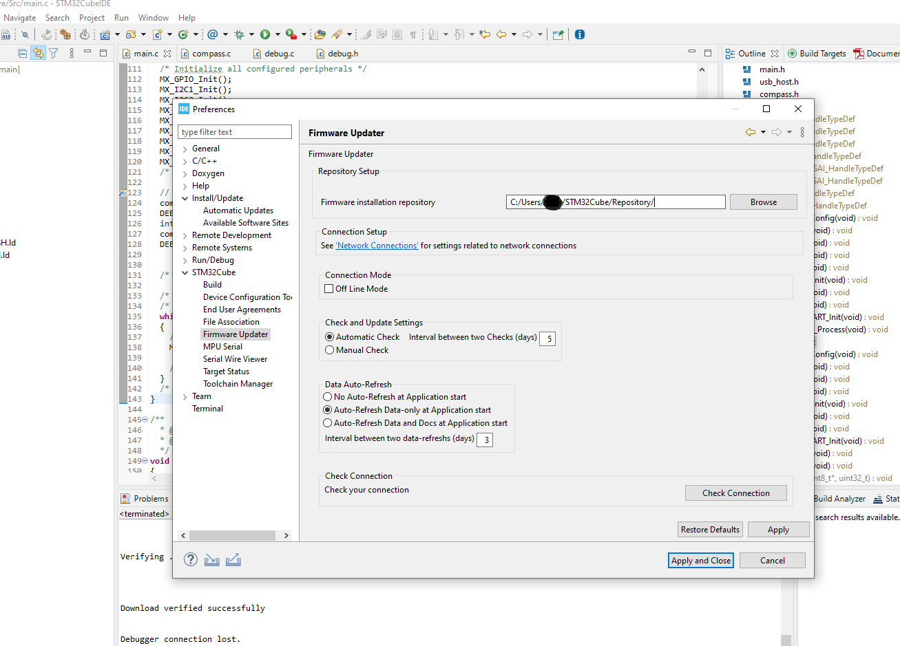

# How to use the bsp

1. Find BSP in your installation

2. Copy content from Drivers/BSP to your Projects Drivers Folder

3. Cleanup - other not needed Boards

4. Add missing include Paths in your program

5. compile it